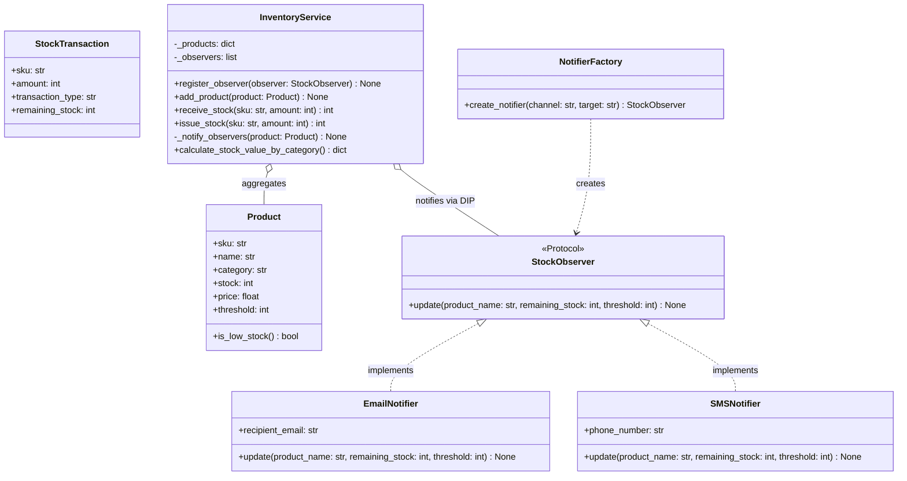

# Class Diagram: Inventory System

```mermaid
classDiagram
    class Product {
        +sku: str
        +name: str
        +category: str
        +stock: int
        +price: float
        +threshold: int
        +is_low_stock() bool
    }

    class StockTransaction {
        +sku: str
        +amount: int
        +transaction_type: str
        +remaining_stock: int
    }

    class StockObserver {
        <<Protocol>>
        +update(product_name: str, remaining_stock: int, threshold: int) None
    }
    

    class EmailNotifier {
        +recipient_email: str
        +update(product_name: str, remaining_stock: int, threshold: int) None
    }

    class SMSNotifier {
        +phone_number: str
        +update(product_name: str, remaining_stock: int, threshold: int) None
    }

    class NotifierFactory {
        +create_notifier(channel: str, target: str) StockObserver
    }

    class InventoryService {
        -_products: dict
        -_observers: list
        +register_observer(observer: StockObserver) None
        +add_product(product: Product) None
        +receive_stock(sku: str, amount: int) int
        +issue_stock(sku: str, amount: int) int
        -_notify_observers(product: Product) None
        +calculate_stock_value_by_category() dict
    }

    StockObserver <|.. EmailNotifier : implements
    StockObserver <|.. SMSNotifier : implements
    InventoryService o-- Product : aggregates
    InventoryService o-- StockObserver : notifies via DIP
    NotifierFactory ..> StockObserver : creates
```
